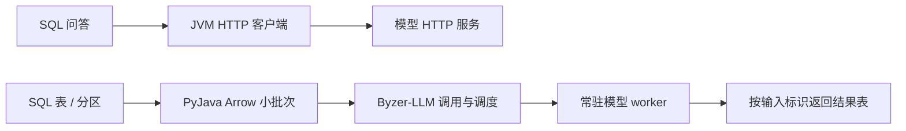

# PyJava、Byzer-LLM 与 SQL引擎：高性能交互需要完善什么

核对日期：2026-09-24。本文接续[项目关系文档](pyjava-byzer-llm-infinity-sql-relationship.md)，回答“接下来该改什么”。依据是当前三个本地工作区的源码；下文的改进方案尚未实施，也没有模型端到端压测结果。

**建议先完成三个目标：SQL 能调用正确的模型，并完整拿回结果；大表能按小批次持续供给模型；请求多起来之后，队列、内存和失败重试仍然可控。** 完成这些之后，再根据测量决定要不要替换 HTTP 客户端、进一步减少序列化，或引入新的服务接口。

三者的分工是：SQL引擎及其 `byzer-llm` 插件负责把数据处理任务接到模型上；PyJava 负责 JVM、Python、Ray 之间的执行与数据交换；Byzer-LLM 负责调用模型，并通过具体后端执行推理。高性能取决于这几层能否按同一个请求和结果协议持续协作。

**先区分两种使用场景。** “问一句话尽快回答”和“处理一百万行文本”需要的调用方式不同。

| 使用场景 | 优先采用的调用方式 | 最关心的指标 |
| --- | --- | --- |
| SQL 中调用一个已存在的模型 HTTP 服务 | 使用现有 JVM 原生 HTTP 分支；服务可以由 Byzer-LLM 提供，也可以来自其他提供方 | 单次完整响应时间、并发时的尾延迟、错误率 |
| SQL 大表做摘要、分类、embedding 等任务，模型在自己的 Python/Ray 环境里 | 建设分区级推理入口，利用 PyJava 传输有大小限制的 Arrow 批次，持续交给 Byzer-LLM 和常驻模型 worker | 成功行数/秒、tokens/秒、GPU 利用率、整体任务耗时与资源占用 |
| SQL 大表调用远端 HTTP 模型服务 | 分区级入口以受控并发调用 HTTP；服务支持专用批量接口时才使用该接口 | 成功吞吐、上游限流、调用费用、重试量 |

下面两条是建议的职责划分。第二条还需要补齐模型批处理接入，不能当作当前已经跑通的 SQL 功能。

第一条路径中，Byzer-LLM 可以在服务端部署、管理和调用模型；SQL 客户端直接访问服务地址。第二条路径中，PyJava 是数据传输基础，应该充分使用已经具备的批次能力。部署、加载权重是前置工作，模型应在后续请求间保持可用。

这里的 JVM HTTP 能力来自 `byzer-ai-core`，现有 `byzer-llm` 插件也接入了它。使用 HTTP 分支不意味着必须再安装 `byzer-native-llm`；这两个插件的 POM 声明了相互冲突。具体使用哪个分支，要由模型配置与实际路由决定。[HTTP 客户端][S1]、[路由实现][S2]、[byzer-llm POM][S3]、[byzer-native-llm POM](../../infinity-sql/mlsql-extensions/core/byzer-native-llm/pom.xml)

**当前首先要解决的是调用契约。** 下列问题由源码可以确认；“实际部署会怎样表现”仍需要在选定环境中验证。

| 已看到的代码行为 | 为什么影响后续优化 | 首先该做什么 |
| --- | --- | --- |
| 通用 SQL 适配中，`deploy()` 使用 Ray 版 `ByzerLLM`，`chat()` 却固定选择 `product_mode="lite"` | 部署成功和查询成功可能指向不同注册信息；同名 Ray actor 与 HTTP 模型配置不自动等价 | 给模型显式记录后端类型、目标 actor 或 endpoint；部署和查询解析到同一目标。记录实际选中的路由，配置不匹配时尽早报错 |
| Byzer-LLM 调用 `get(worker_id)` 和 `async_apply(...)`；本仓库的 PyJava UDF 实现只有无参 `get()` 和同步 `apply(...)` | 这组源码不能直接视为兼容的 Ray 调用组合 | 选择兼容发行版，或对齐接口、异步执行和返回格式；验证真正导入的包位置 |
| 通用 `chat()` 每处理一条输入就追加一行输出；对应 `Ray.predict()` 注册函数用 `.head` 取返回数据首行 | 一次 UDF 传多条输入时，存在只保留首行结果的风险；加大输入批次可能先造成丢结果 | 先统一“单行装结果数组”或“多行结果表”的契约；检查输入输出数量、标识和顺序 |
| `apps/byzer_sql.chat()` 逐条同步调用；`simple_predict_func()` 在循环里逐条 `await` | 一次带多条输入减少了传输次数，但这两个通用函数内部仍然逐条等待 | 对支持的后端加入有上限的并发，或调用真正的模型批量接口 |
| SQL 聊天适配通过 `PythonContext.fetch_once_as_rows()` 读取输入，经过 Arrow → Pandas → Python 字典 | 小请求也会经过这些转换；大输入会多一份对象化开销 | 在测量后去掉不需要的转换；表级路径接入 Arrow 批次 API，并只提取模型必需的列 |

证据分别见 [SQL 适配层][B1]、[ByzerLLM 的 _query()][B2]、[PyJava UDF 实现][P1]、[SQL 的 Ray.predict()][S4]、[通用预测循环][B3]和 [PythonContext / RayContext][P2]。第三项是根据两端代码推导出的多输入风险，本次没有执行该链路复现。

兼容性还包括构建与安装。当前 PyJava Python 源码版本为 `0.3.3`；Byzer-LLM 源码版本为 `0.1.223`，其 `ray` 扩展依赖声明 `pyjava>=0.6.21`、`ray[default]==2.47.1`。Ray/PyJava 现在属于可选扩展，不能把这组依赖说成所有 HTTP 用法的前置条件。SQL 的这个通用 Python 适配本身仍会导入 Ray/PyJava。[Byzer-LLM 安装配置][B4]、[PyJava 版本][P3]

JVM 侧，当前 PyJava 默认构建为 Spark `4.1.2` / Scala `2.13`，SQL 插件父 POM 默认是 Spark `3.3.0` / Scala `2.12`。联调时应选定一套兼容构建，核对实际发布的 JAR 和 Python 包，不能用两个仓库的默认产物直接拼装。这是部署组合的要求，不能仅靠修改版本字符串解决。[PyJava POM][P4]、[插件父 POM][S5]

**大表性能的重点，是把“传得成批”接到“模型持续有工作做”。** 这里有三个不同的概念。

| 概念 | 它解决什么 | 它没有自动保证什么 |
| --- | --- | --- |
| 传输批次：一次 Arrow 或 RPC 携带多条记录 | 摊薄跨进程调用、编码和调度开销 | 模型会同时处理这些记录 |
| 在途并发：同时有多条请求正在等待或执行 | 避免每条都结束后才提交下一条，为模型持续供给请求 | 请求越多，吞吐一定越高 |
| 模型组批：推理后端把请求组织成计算批次 | 提高设备利用率；生成模型还可在不同生成阶段调度请求 | 上游无限提交不会增加排队、显存压力和尾延迟 |

例如，传入 64 条文本，内部仍然逐条等待，就没有因为“64 条一起传”而获得 64 路推理并发。若改成最多 8 条在途，模型后端才有机会同时调度这些请求；实际模型批次大小由后端、上下文长度和显存等共同决定。这里的 64 和 8 只是解释用数字，不是推荐配置。

vLLM 支持对到达的请求进行连续组批，所以不同 Spark task 并发发来的标量 UDF 请求也可能在模型端合批。当前更准确的问题是：应用层没有明确控制供给粒度和并发，通用函数内还存在逐条等待；不能据此断言 vLLM 一定无法组批。[vLLM 官方功能说明](https://docs.vllm.ai/en/v0.10.1/)

对一个处理大表的分区级入口，建议约定以下行为：

1. 从分区迭代器读取有限大小的批次，同时限制行数、字节数和估算 token 数。分区可以很大，整分区一次性装入内存不可作为默认实现。
2. 每条输入携带稳定的业务行标识与请求标识。每条输出对应输入标识，包含成功结果或明确错误，避免只靠完成顺序拼接。
3. 向模型提交有限数量的在途请求，达到上限就等待结果释放容量。总并发还要受模型侧限额约束，防止多个 Executor 的局部并发相乘后压垮服务。
4. 完成的结果分批写回；出现慢请求、失败和取消时，能够释放容量，并让其余结果按约定继续或整体失败。

这应当作为新的表级推理能力接入 SQL 插件；保留现有标量 UDF 供方便调用。PyJava 已有的 `RayContext.map_batches()` 可以直接处理 Arrow `RecordBatch`，但需要由新的推理适配将它连接到模型，不能只把现有聊天函数改个名字。

远端 HTTP 也可以采用同样的有界输入与并发控制。不过，普通 Chat Completions 的 `messages` 是一段对话，不能把多条独立任务混在其中当作批量请求。是否能“一次 POST 多条任务”取决于服务是否提供对应协议；否则就是受控地发出多次请求，并逐条关联结果。

**按项目分工，最值得完善的是这些接口。** 表中的内容是建议工作项。

| 负责项目 | 应完善的能力 | 可观察的完成标准 |
| --- | --- | --- |
| SQL引擎及插件 | 显式模型路由；分区级推理入口；批次与并发预算；结果标识和逐条错误；Executor 上的插件分发与配置读取 | 一次表任务能处理多批输入，全部结果可对回原行；多个 Executor 调到同一配置的目标；没有静默漏行 |
| PyJava | 对齐 Ray UDF 协议；可超时的 worker 获取与可靠归还；向上暴露已具备的 Arrow 批次和生命周期配置 | 正常、超时、取消、异常后均无悬挂借用；输入变大时内存保持在预算内；不需要经过 Pandas 的路径确实跳过转换 |
| Byzer-LLM | 统一 SQL 适配的部署/查询后端；适配批次结果协议；用有限并发或后端批量 API 替代逐条等待；区分模型副本数与单副本请求容量 | 一批请求结果完整；后端能看到预期的在途量；模型实例持续复用，错误和取消按约定返回 |

这里要区分两类 worker：Python worker 是 PyJava 借出的 Python 执行进程；模型 worker 是 Ray 中常驻模型的 actor。二者具有各自的复用和并发限制。

其中 PyJava 的 `UDFMaster.get()` 当前在无空闲模型 worker 时每毫秒轮询，缺少这一层的获取期限。改善它时，要一起定义排队上限、获取超时、异常归还和取消语义；如果模型任务仍在执行，不能仅因调用方超时就把该 worker 当成完全空闲。给 `UDFWorker` 增加一个 `async_apply` 方法名，也不足以保证请求真正并发或正确 `await`。[PyJava UDF 实现][P1]

这里有两项基础已经具备，可以直接利用。PyJava 已有 Python worker 及连接复用，因此一次 SQL 调用跨过 Python 边界，不代表每次新建 Python 进程。分区交换也已有批次限制、资源清理以及快照机制；接下来需要的是把这些能力接入模型调用，并验证并发分区的总资源占用。[传输可靠性说明](transport-reliability.md)、[Spark/Ray 传输验证记录](spark-ray-transfer-validation-2026-09-23.md)

**交互问答的优化，应从现有 HTTP 路径和实际耗时入手。** 对已有 HTTP 服务，先打通 SQL → JVM HTTP → 模型服务的链路，并确认它实际省下了哪些转换。对于只有 Ray actor、尚未提供 HTTP 服务的部署，可以先修通现有 Python/Ray 路径；是否增加 HTTP 服务，应另行测量和评估。JVM 直接调用 Ray actor 涉及新的集成工作，不是现成的开关。

当前 `AIClient` 每次创建 `HttpURLConnection`，读完整个响应后调用 `disconnect()`，连接和读取超时都由同一个配置值派生。这说明其应用层缺少独立的连接池容量、排队期限和连接复用指标，但不能直接证明每次请求都进行了新的 TCP/TLS 握手：JDK 文档明确允许底层连接在请求对象之间共享，`disconnect()` 则可能关闭空闲的底层连接。[客户端实现][S1]、[JDK 官方说明](https://docs.oracle.com/javase/8/docs/api/java/net/HttpURLConnection.html)

实际改进可以是具有明确生命周期的 HTTP 客户端、按目标限制在途量，分别配置连接超时、读取超时和整体截止时间，并记录连接复用与重连次数。HTTP/2 是否有收益，要看客户端运行环境和上游支持情况，不作为第一阶段前提。若保留 Python lite 路径，也要检查 `get_single_llm()` 创建客户端的频率，设计可安全复用、配置变更后可更新的客户端生命周期。[当前客户端工厂][B5]

交互体验若需要逐 token 展示，应在服务接口上验收流式输出和首 token 延迟。当前 SQL `ai_*` 是等待完整结果的同步文本接口，普通结果单元格的返回方式不承担逐 token 展示。

**吞吐提高后，还要避免资源和重试把收益吃掉。** 优先补两类约束。

第一类是 Spark 生产任务与慢速模型消费之间的生命周期。当前引擎建立 Spark 分区 Arrow 服务时，没有传入 PyJava 的 detached 配置，生产 task 会等待下游消费。这在持续、及时消费的情况下可以避免额外落盘；模型消费很慢时，则可能长时间占用 Spark task。建议在引擎层暴露选择：直接流式传输，或先完成受配额限制的快照后释放生产任务。后者会增加落盘与启动等待，要测量后选用。[引擎的分区服务接入][S6]

需要区别两种快照：Spark detached 导出提供一次性消费端点；Ray 结果服务的快照在租期内支持重读。两者都不能被描述成“服务失败后任意恢复”。现有配额主要针对单分区；多个分区并发时，还需要主机级内存、磁盘和队列预算。[传输验证记录](spark-ray-transfer-validation-2026-09-23.md)

第二类是模型调用的重复执行。Spark task 重试或推测执行可能重复发起模型请求，导致重复费用，生成结果也可能不同。读取已经产生的结果快照，可以避免某些读取重试再次运行计算，但不等于推理调用具备 exactly-once 保证。大表入口应明确哪些失败可以重试；需要恢复的任务应记录完成状态或结果，并以输入内容/版本、模型版本、提示词和参数等区分请求。取消任务时，也应尽可能取消在途推理或等待其结束再回收执行容量。

**建议分四步推进，每步都有可以检查的结果。** HTTP 场景与 Ray 场景只处理各自相关的依赖；不需要等所有路线一起完成才能开始验收。

| 顺序 | 做什么 | 交付与验收 |
| --- | --- | --- |
| 1. 把一条选定链路跑对 | 固定部署组合，确认实际导入位置；对齐路由、UDF API 和输入输出契约 | 1 条和多条输入均返回完整结果；日志能证明实际命中哪个 endpoint/actor；没有同名模型误路由 |
| 2. 建立可比较的基线 | 分别测试只返回固定结果的替代服务、直接模型调用、完整 SQL 调用；区分冷启动和预热后 | 得到桥接、排队、网络和模型执行时间的分项记录；知道真正的主要瓶颈 |
| 3. 先改影响最大的环节 | 大表优先做分区批次与有限并发，并接上 Byzer-LLM 执行；问答按基线改善 HTTP 客户端生命周期或多余转换 | 在同样数据、模型、硬件与生成参数下比较延迟和成功吞吐；输出完整、错误率与资源占用可接受 |
| 4. 验证高负载下能稳定结束 | 扩大并发分区；注入慢模型、超时、取消、连接中断、worker 退出和任务重试 | 队列不持续增长、内存和磁盘有界、无结果静默丢失、无 worker 永久占用；重复调用可识别和解释 |

测量时，问答看完整响应的 p50/p95、错误率；流式接口另外看首 token 延迟。大表看成功行数/秒、tokens/秒、总耗时、队列等待、CPU/GPU 利用率及峰值内存。批次大小与并发量应逐步调整，并固定输入输出长度分布；不要把输出变短、少返回结果或失败跳过当作吞吐改善。

作为第一轮开发的具体范围，建议完成“显式路由 + 兼容包组合 + 多输入结果校验 + 一条有界批量链路 + 基线记录”。拿到这组结果后，就能判断下一轮应优先减少 Pandas/JSON 转换、调整模型并发，还是改善 HTTP 连接管理，而不是仅凭调用层数推测瓶颈。

**本次核对范围与源码定位。** 本文没有启动模型、修改实现或执行性能测试。源码快照为 PyJava `fcf7066`、Byzer-LLM `e08ea92a`、Infinity SQL `e71030b`；版本与依赖说明以本次读取为准。

下表与正文链接相对于当前 `pyjava/docs/`。将 Markdown 单独发送到 Telegram 后，跨仓库链接需在三个仓库并列的工作区中打开；仓库内路径和函数名仍可用于定位。

| 项目 | 主要入口 | 用来复核什么 |
| --- | --- | --- |
| PyJava | [python/pyjava/udf/__init__.py][P1] | master/worker 接口、轮询等待、借用与归还 |
| PyJava | [python/pyjava/api/mlsql.py][P2] | `PythonContext.fetch_once_as_rows()` 的 Pandas 转换；`RayContext.map_batches()` |
| Byzer-LLM | [src/byzerllm/apps/byzer_sql/__init__.py][B1] | SQL 部署和查询选用的客户端、逐条结果 |
| Byzer-LLM | [byzerllm_client.py][B2]、[text_generator.py][B3] | `_query()` 的 Ray API、`simple_predict_func()` 的执行粒度 |
| Byzer-LLM | [setup.py][B4]、[llms/factory.py][B5] | 可选依赖与 lite 客户端创建 |
| SQL引擎 | [AIUDF.scala](../../infinity-sql/mlsql-extensions/core/byzer-ai-core/src/main/java/tech/mlsql/plugins/llm/ai/AIUDF.scala)、[AIClient.scala][S1]、[AIModelRuntime.scala][S2] | 标量函数、HTTP 生命周期、目标路由 |
| SQL引擎 | [Ray.scala][S4]、[MasterSlaveInSpark.scala][S6] | `.head` 返回契约、Python 执行入口、Spark 分区服务生命周期 |

[P1]: ../python/pyjava/udf/__init__.py
[P2]: ../python/pyjava/api/mlsql.py
[P3]: ../python/pyjava/version.py
[P4]: ../pom.xml
[B1]: ../../byzer-llm/src/byzerllm/apps/byzer_sql/__init__.py
[B2]: ../../byzer-llm/src/byzerllm/utils/client/byzerllm_client.py
[B3]: ../../byzer-llm/src/byzerllm/utils/text_generator.py
[B4]: ../../byzer-llm/setup.py
[B5]: ../../byzer-llm/src/byzerllm/llms/factory.py
[S1]: ../../infinity-sql/mlsql-extensions/core/byzer-ai-core/src/main/java/tech/mlsql/plugins/llm/ai/AIClient.scala
[S2]: ../../infinity-sql/mlsql-extensions/core/byzer-ai-core/src/main/java/tech/mlsql/plugins/llm/ai/AIModelRuntime.scala
[S3]: ../../infinity-sql/mlsql-extensions/contrib/byzer-llm/pom.xml
[S4]: ../../infinity-sql/streamingpro-mlsql/src/main/java/tech/mlsql/ets/Ray.scala
[S5]: ../../infinity-sql/mlsql-extensions/pom.xml
[S6]: ../../infinity-sql/streamingpro-mlsql/src/main/java/tech/mlsql/tool/MasterSlaveInSpark.scala
