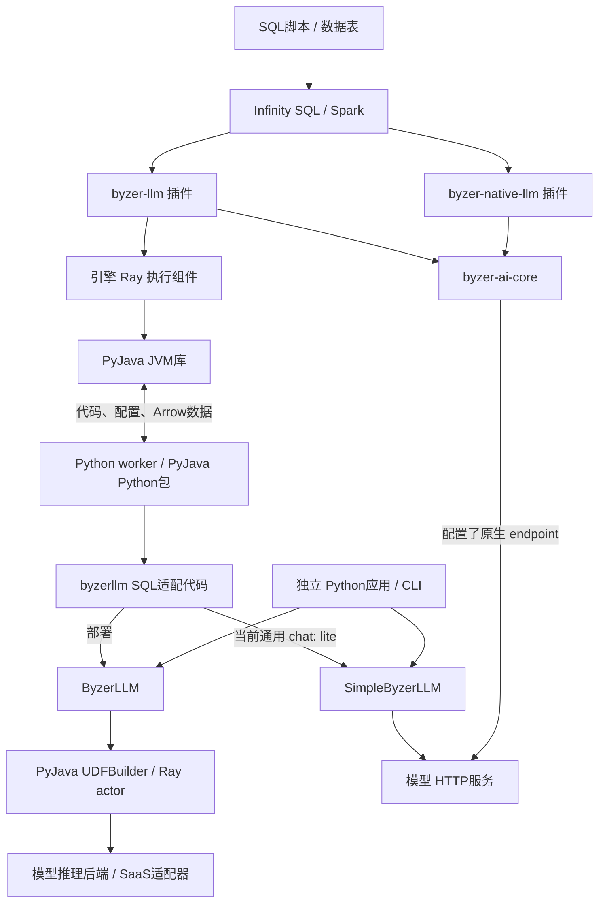
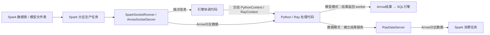

# PyJava、Byzer-LLM 与 Infinity SQL LLM 插件的关系

核对日期：2026-09-23。本文依据三个本机工作区的源码，说明项目职责、依赖方向和实际调用链。文中的“SQL引擎”指 `infinity-sql`，也就是 Byzer-SQL / MLSQL 体系的执行引擎。

**PyJava 提供跨语言执行和数据交换；Byzer-LLM 提供模型部署、推理与训练能力；SQL引擎的 `byzer-llm` 插件把这些能力接到 SQL 中。** 三者分属基础设施、模型能力和 SQL 接入层。Python 应用可以直接使用 Byzer-LLM；SQL 调用已存在的 HTTP 模型服务，也有直接从 JVM 发请求的路径。

需要同时保留两个事实：这些项目在架构上能够组成完整链路，但当前本地源码存在接口和路由差异，不能把架构关系图当成已经通过联调的部署方案。尤其是 PyJava Python 包版本，以及 Byzer-LLM 的 SQL 聊天适配分支，见后文兼容性说明。

## 1. 先分清名称

| 代码或文档中的词 | 实际含义 | 在这组项目中的位置 |
| --- | --- | --- |
| `pyjava` | 同一仓库提供 JVM 库和 Python 包 | 基础执行、Arrow 数据传输、Python worker 和 Ray 辅助代码 |
| Byzer-LLM / `byzer-llm` 仓库 | 大模型部署和使用相关的 Python 项目 | 安装包、导入名和 CLI 都是 `byzerllm` |
| `byzer-llm` 插件 | SQL引擎里的 Scala/JVM 扩展 | 位于 `mlsql-extensions/contrib/byzer-llm`，与 Python 仓库分别构建、分别安装 |
| `byzer-native-llm` | SQL引擎里的另一种 LLM 插件 | 用 Scala/JVM 调用模型 HTTP 接口 |
| `byzer-ai-core` | 两个 SQL 插件共享的 JVM 库模块 | 模型配置、路由、HTTP 客户端与 `ai_*` 函数实现 |
| ET / `run command as LLM` | SQL DSL 中调用的处理组件 | 插件把部署、微调等操作注册成 SQL 可调用入口 |
| SQL UDF | 在 `select` 中调用的函数 | 可以包装 Python/Ray 调用，也可以包装 HTTP 调用 |
| Ray actor / `UDFMaster` / `UDFWorker` | Ray 中长期保留状态的对象，以及管理者、模型工作者 | 与 Spark SQL UDF、PyJava 的 Python worker 是不同对象 |
| `RayContext` | PyJava 对 Python 上下文、Ray 连接、分区端点的封装 | 不是 SQL引擎，也不是模型本身 |
| Arrow / IPC / socket | 表格数据格式、跨进程编码与网络连接 | 用于 JVM↔Python 或 Spark↔Ray 的数据交换；不是模型推理后端 |
| `infer` / `deploy` | 具体行为由调用入口决定 | `LLM action=infer` 可部署并注册函数；`NativeLLM deploy` 注册 HTTP 函数；`SimpleByzerLLM.deploy` 保存客户端配置 |

## 2. 项目如何连接



图中的两个 SQL 插件是不同装配选择。其 POM 都声明了与对方的 `conflictsWith`，不能把二者一起作为有效插件加载。两者共用 `byzer-ai-core`，所以 `ai_*` 函数并非只有其中一个插件才具备。图中 Python 侧的 `lite` 分支是当前本地代码的实际选择，详见第 4 节。[S1]、[S2]、[S3]、[B2]、[B3]

依赖通过 Maven、Python 导入和 HTTP 三种方式建立：

| 依赖方 → 被依赖方 | 怎样连接 | 对安装和运行的含义 |
| --- | --- | --- |
| SQL引擎 → PyJava JVM 库 | `streamingpro-core/pom.xml` 的 Maven 依赖 | PyJava JVM 代码随引擎依赖进入 Java classpath |
| SQL插件 → Byzer-LLM Python 包 | Scala 生成 Python 代码，在运行时导入 `byzerllm` | 安装插件 JAR 不会自动安装 Python 包、Ray 或模型权重 |
| Byzer-LLM → PyJava Python 包 | `requirements.txt` 与 Python import | 即使不启动 SQL引擎，Ray 版 Byzer-LLM 仍使用 PyJava 的 Python 组件 |
| 两个 SQL插件 → `byzer-ai-core` | Maven 库依赖 | 共享配置、函数与 HTTP 客户端，不等于两个插件可以并装 |
| HTTP 客户端 → 模型服务 | HTTP/JSON | 服务可以来自云端，也可以来自自部署服务；客户端无需知道服务内部是否使用 Ray |

这里的 JVM 依赖和 Python 依赖要分别核对。一个正确版本的 JAR，不能证明 Python worker 实际导入了正确版本的 `pyjava` 或 `byzerllm`。[S4]、[B1]

## 3. 每个项目承担什么

### PyJava：让 JVM 程序执行 Python，并交换数据

JVM 侧的 `ArrowPythonRunner` 把配置、代码和输入记录写给 Python worker，再把返回的 Arrow 批次转换成 Spark 可处理的数据。`PythonWorkerFactory` 管理 worker 的创建、借用和归还；Python 侧的 `worker.py` 执行代码，`PythonContext` 提供读取输入与构造输出的接口。[P1]、[P2]

PyJava 还提供 Spark/Ray 分区交换：`SparkSocketRunner` 和 `ArrowSocketServer` 提供或读取 Arrow 数据流；`RayContext`、`RayDataServer` 等在 Python/Ray 侧消费分区、执行变换并返回结果端点。[P3]、[P4]

Python 包中的 `UDFBuilder`、`UDFMaster`、`UDFWorker` 则提供通用的 Ray 函数服务骨架。初始化模型和如何预测由上层传入；PyJava 本身不解释聊天模板，也不决定选哪个模型后端。当前本地版本的这组接口与 Byzer-LLM 所需接口并不完全一致，不能只凭同名类认定兼容。[P5]、[B2]

### Byzer-LLM：部署、调用和训练模型

`ByzerLLM.deploy()` 选择模型模块或 SaaS 适配器，准备初始化和预测函数，再交给 PyJava 的 `UDFBuilder` 建立 Ray 服务。`chat_oai()` 最终经 `_query()` 找到具名 actor、借用模型 worker、调用预测并归还 worker。模型权重通常保留在模型 worker 中，不是在每次 SQL 请求时重新加载。[B2]

本地源码还有预训练、微调、LoRA 合并、embedding、rerank、流式生成及检索相关入口。实际训练和推理由对应 Python 模块、Transformers、vLLM、DeepSpeed 等后端承担；存在入口不代表每个后端、模型和版本组合都已经验收。[B2]、[B4]

`SimpleByzerLLM` 是另一路客户端实现。其 `deploy()` 为支持的 SaaS 类型创建 HTTP SDK 客户端并保存别名、服务地址等信息，`chat_oai()` 通过该客户端调用服务。这条调用路径不创建 Ray 模型 actor，但不能据此认为整个 Python 包在安装或导入时已经移除了 Ray/PyJava 依赖。[B3]、[B1]

### SQL引擎与插件：提供 SQL 入口并衔接数据处理

SQL引擎负责解析执行脚本、管理 Spark 会话与数据表、运行计算任务、注册 UDF。其 `tech.mlsql.ets.Ray` 负责把 Python 代码和数据交给 PyJava，属于引擎提供的执行能力。[S5]

`byzer-llm` 插件的 `LLMApp.start()` 注册 `LLM`、`Retrieval`、`LLMQABuilder`、`AIModels`、`ModelAdmin`，以及 `model`/`model2` 数据源、`llm_*` 和 `ai_*` 函数。`LLM.train()` 根据 `action` 与 `pretrainedModelType` 选择推理部署、微调、合并或转换实现。[S1]、[S6]

例如 `custom/` 和通用 `saas/` 分支会生成导入 `byzerllm.apps.byzer_sql` 的 Python 代码，再交给引擎的 `Ray.predict()`。模型算法留在 Python 项目中，SQL插件负责参数转换、注册入口和返回值衔接。[S7]

## 4. 部署一个模型，与调用一次模型，是两件事

### 直接从 Python 或 CLI 使用

Ray 版的典型过程是：连接 Ray → 配置模型 worker 数及资源 → `ByzerLLM.deploy()` → 注册具名 Ray actor → `chat_oai()` 调用 actor。CLI 的 `deploy`、`query`、`undeploy` 也调用这些 Python 接口。这个过程不要求先启动 Spark 或 SQL引擎。[B2]、[B4]

这一判断针对调用职责和代码入口。它以满足 Byzer-LLM 所需的 Python 依赖为前提，并不表示当前 PyJava 工作区可以直接替代其要求的发行包。

### 从 SQL 部署并注册函数

以插件的 `custom/` 通用分支为例，部署链是：

1. `LLM.train(action="infer")` 选择 `custom.Infer`。
2. `custom.Infer` 生成 `prepare_env()`、`deploy()` 代码，传入 `Ray.predict()`。
3. 未设置 `reconnect=true` 时，`Ray.predict()` 先运行部署代码；PyJava 启动或复用 Python worker。
4. `prepare_env()` 连接 Ray；Python 的 SQL 适配层将参数交给 `ByzerLLM.deploy()`。
5. 引擎再注册名为 `udfName` 的 Spark SQL 函数，供后续 `select` 调用。

因此，这里的 `action="infer"` 包含服务准备和函数注册，不只是生成一段回答。`reconnect=true` 跳过部署代码，只重建 SQL 函数入口；它不会替用户创建缺失的 Ray 模型。[S5]、[S7]、[B5]

下面只展示参数和函数之间的关系，环境、资源和版本仍需另外配置，未作为本次联调脚本执行：

```sql
run command as LLM.``
where action="infer"
and pretrainedModelType="custom/auto"
and localModelDir="/models/example"
and udfName="example_chat"
and modelTable="command";

select llm_result(
  example_chat(llm_param(map("instruction", "请解释这张表的用途")))
) as answer;
```

此分支读取模型目录的字段是 `localModelDir`，随后转换为 Python `deploy(model_path=...)` 的参数。仅按部分说明中的 `model_path` 名称填写 SQL 参数，不能认定模型目录会正确传入。[B5]

### 当前源码中的 SQL 聊天调用有一个分岔

上例通用分支注册的预测代码会调用 `byzerllm.apps.byzer_sql.chat()`。在本地 Byzer-LLM 快照中，它明确执行：

```python
llm = byzerllm.get_single_llm(udf_name, product_mode="lite")
```

`get_single_llm(..., "lite")` 按名字读取模型配置，构造 `SimpleByzerLLM`，然后走 HTTP。只有其 `"pro"` 分支选择 Ray 版 `ByzerLLM`。所以，**当前通用 SQL 分支的部署阶段创建 Ray 模型服务，聊天阶段却按同名配置选择 HTTP 客户端**；它并没有因为部署过同名 actor 就自动调用该 actor。[B5]、[B6]

预测前的 `prepare_env()` 仍会连接 Ray。因此，“最后一段推理走 HTTP”也不等于整条 SQL 路径已经不需要 Ray。HTTP 模型别名、Ray actor 名、Spark UDF 名虽可能使用同一个字符串，却属于三个不同的注册空间。

模型配置读取入口是 `utils/modelinfo.py`，默认配置文件为 `~/.auto-coder/keys/models.json`。本次只检查读取代码，没有读取配置文件或密钥。该入口还导入 `autocoder.common.auto_coder_lang`，属于此分支额外的运行时耦合，不应被理解成 SQL引擎的必需上层服务。[B6]

SQL 侧 `llm_param()` 将参数打包成 `array<string>` 中的 JSON，模型函数返回同类字符串数组，`llm_result()` 从第一个 JSON 结果提取 `output`。`llm_stack()` 把返回的 `history` 合入下一轮请求；这类聊天历史通过调用参数传递，不等于系统自动维护会话存储。[S8]

## 5. Spark 表、训练数据和模型文件怎样流动

SQL 函数传递少量请求时，`Ray.predict()` 设置 `directData=true`，把字符串请求直接送入 Python worker。训练或分区处理走另一条路径：Spark 提供数据端点，Python/Ray 再按端点读取分区，而不是要求把整张表先收集到 driver。[S5]



`MasterSlaveInSpark.defaultDataServerImpl()` 创建 Spark 分区的 Arrow 服务并报告地址；`Ray.distribute_execute()` 把这些地址交给 Python。启用 `dataMode=data` 时，Python 返回 Ray 结果服务地址，引擎通过 `SparkSocketRunner.readFromStreamWithArrow()` 再读取真实结果。[S5]、[S9]、[P3]、[P4]

微调分支也沿用这套接入方式。例如 `custom/SFT.scala` 导入具体模型模块的 `sft_train`，传入 `ray_context.data_servers()`、训练参数和上下文配置。训练算法属于 Byzer-LLM/其后端，表格到 Python 的交付属于引擎与 PyJava。[S10]

模型文件也有数据化通路：Byzer-LLM 的 `load_model()`、`restore_model()` 使用 PyJava 的 `streaming_tar`，把文件与二进制行互转；另一些部署直接使用 Ray worker 所在机器的本地模型目录。不能把“模型目录在 SQL driver 上存在”当成所有 Ray 节点都可读取。[B7]

### 当前 PyJava 的可靠性改动影响哪一段

本仓库已经区分了 Python worker 池和分区数据端点的生命周期，并提供原生 Arrow 批次接口 `RayContext.map_batches()`、分区快照配额、超时与 Ray 输出快照重读。详细约定见 [传输可靠性说明](transport-reliability.md) 和 [Spark/Ray 验证记录](spark-ray-transfer-validation-2026-09-23.md)。

这些能力有明确边界：

- 当前 SQL引擎的 `MasterSlaveInSpark` 使用直接流式导出，并等待服务关闭，保持生产任务存活；它没有在此调用中传入 `python.socket.detached=true`。PyJava 示例里的 detached 快照不会因同名依赖自动应用到该调用点。
- 先结束生产任务、再由下游读取时，PyJava 的 detached 选项先提交分区快照；Ray 输出快照允许在租期内重新读取。它们分别解决生产任务生命周期和消费重试问题，不代表自动重跑训练或模型请求。
- `map_batches()` 提供 Arrow 批次接口，但当前 SQL 聊天适配使用的是 `fetch_once_as_rows()`。`PythonContext` 的该路径会经过 Pandas；因此不能把整个 LLM 调用说成“全程零拷贝”或“自动改成 Arrow 列式运算”。
- Python↔Ray 的 actor 调用使用 Ray 的调用机制，模型 HTTP 请求使用 HTTP/JSON；Arrow 主要覆盖 JVM/Python 和分区传输边界。

源码依据：[P1]、[P2]、[P3]、[P4]、[S9]。上述链接中的既有传输测试记录是相应测试环境的历史证据，不是本次三项目 LLM 联调结果。

## 6. SQL 只需要调用现成模型 API 时

当前 SQL源码提供了 JVM 原生路线：

```text
SQL ai_query / ai_gen / ai_summarize 等函数
  → byzer-ai-core 的 AIRouter
  → AIClient
  → OpenAI兼容的 chat/completions HTTP接口
```

`AIModelConfig.isNative` 的条件是存在 endpoint 且 `backend != "ray"`。满足条件时直接调用 HTTP；否则，`AIRouter` 查找同名的、已注册的 SQL 模型 UDF。这个回退动作本身不会创建 Ray 模型，也不能证明被找到的 UDF 内部一定调用 Ray。[S3]

这条原生能力同时被 `byzer-llm` 和 `byzer-native-llm` 使用。若装配的是 `byzer-native-llm`，入口是 `NativeLLMApp`，提供 `NativeLLM`、`!nativellm`、`AIModels`、`!aimodels` 与相关函数。源码明确将微调、权重合并、转换和 retrieval 排除在 `NativeLLM` 的动作范围之外。[S2]、[S11]

| 所在入口 | `deploy` 实际创建什么 | 模型权重在哪里 |
| --- | --- | --- |
| `ByzerLLM.deploy()` | Ray 中的模型服务；SaaS 类型则是调用外部服务的 actor | 本地模型通常加载到 Ray worker；SaaS 权重由提供方管理 |
| `SimpleByzerLLM.deploy()` | 当前 Python 对象中的模型别名、SDK 客户端和配置 | 外部模型服务 |
| SQL `NativeLLM action=deploy` | 当前 Spark 会话中的模型 UDF；有内联 endpoint 时同时登记配置 | 外部模型服务 |

因此，`NativeLLM deploy` 不会下载权重、分配 GPU 或启动训练。调用已配置 endpoint 的 SQL 请求也不经过 PyJava 的 Python worker；SQL引擎仍可能因为其他 Python 功能而保留 PyJava JVM 依赖，这两件事并不矛盾。

Byzer-LLM 自己也提供 OpenAI 兼容 HTTP 服务入口，将请求交给 `ByzerLLM`。**从接口结构推断**，SQL 原生插件可以把该服务当成上游，从而形成“SQL HTTP客户端 → Byzer-LLM HTTP服务 → Ray 模型”的组合。此时 SQL 进程不进入 Python bridge，但远端服务内部仍使用 Byzer-LLM/PyJava/Ray；这组具体组合本次未运行验证。[B8]、[S3]

## 7. 配置和生命周期分别归谁管理

| 配置或对象 | 所属层 | 容易混淆的地方 |
| --- | --- | --- |
| `pythonExec`、Python 环境、`rayAddress`、输入输出 schema | SQL引擎的 Python/Ray 执行上下文 | 不会由模型权重目录自动推导 |
| Python worker 及其 socket 池 | PyJava JVM 执行层 | worker 复用不等于复用同一个模型 actor；空闲池上限不等于全局并发上限 |
| 分区 socket、快照、有效期和配额 | PyJava 分区交换层 | 与 Python worker 池、模型显存占用分别管理 |
| 模型类型、推理后端、模型 worker 数和资源参数 | Byzer-LLM 及所用 Ray/UDF 实现 | 上层传了参数还要核对底层版本是否实现相应约定 |
| 具名 Ray 模型 actor | Ray 模型服务层 | SQL 函数重注册、Python worker 退出不等于模型服务卸载 |
| `udfName` 与 Spark 函数注册 | SQL 会话层 | `reconnect=true` 重接的是 SQL 调用入口 |
| `mlsql.ai.*`、模型 endpoint、`AIModelRuntime` | JVM 的模型注册与路由层 | 与 Python lite 分支读到的模型配置不是同一个进程内注册表 |

插件启动也不等于自动建立完整 Ray 环境：`MLSQLConfig.run()` 中的 `spark.mlsql.ray.config.service.enabled` 默认是 `false`，未启用时直接返回。具体 Python 环境和资源应以执行任务的上下文为准。[S12]

当前 PyJava 已移除对 `tech.mlsql:common-utils` 的依赖，日志使用 `tech.mlsql.arrow.log.Logging`，分区 Arrow 服务由本仓库的 `ArrowSocketServer` 承担。SQL引擎仍有自己的 `common-utils` 调用，例如报告端点地址；这并不表示 PyJava 的 Arrow 数据服务还由旧 `SocketServerInExecutor` 实现。`PythonProjectRunner` 仍直接依赖 `os-lib`。[P6]、[S9]

## 8. 当前源码快照及需要验证的兼容性

| 工作区 | 核对时 HEAD | 源码中的版本或依赖 |
| --- | --- | --- |
| `~/projects/pyjava` | `eac018c`，2026-09-23 | JVM POM 与 Python `version.py` 都是 `0.3.3` |
| `~/projects/byzer-llm` | `8d28eee1`，2025-07-16 | `byzerllm=0.1.190`；要求 `pyjava>=0.6.21`、`ray[default]>=2.9.1` |
| `~/projects/infinity-sql` | `eedbe1f`，2026-09-23 | 引擎声明 `pyjava-version=0.3.3`；`byzer-llm` 插件 `0.1.0`；`byzer-native-llm` 插件 `0.2.0` |

本次没有拉取远程仓库。Byzer-LLM 和 SQL引擎工作区存在已有未提交改动，结论以实际读取的工作区文件为准；HEAD 用于定位起点，不代表已发布产物或运行中服务版本。Python 仓库的 HEAD 日期较早，也不能称为上游最新版本。[P6]、[B1]、[S4]、[S1]、[S2]

### Python 依赖已有可见的不匹配

不仅是 `0.3.3` 不满足 `>=0.6.21`：当前 Byzer-LLM `_query()` 调用 `udf_master.get.remote(worker_id)` 和 `worker.async_apply.remote(...)`；本地 PyJava 的 `UDFMaster.get(self)` 不接收该参数，`UDFWorker` 也只定义了 `apply()`，未定义 `async_apply()`。[B2]、[P5]

这是静态可确认的接口差异。不能用“JVM 依赖也是 0.3.3”来证明 Python 端兼容，更不能只提高 Python 包版本号便认定修复完成。后续联调需要确认 Python worker 和 Ray worker 实际导入的包路径、版本及 API。

### SQL 部署与聊天路由需要统一解释

第 4 节的 Ray 部署 / lite 聊天分岔是这份 Byzer-LLM 快照的实际代码行为。若期望调用刚部署的 Ray 模型，应先确认所选版本的 SQL 适配层是否沿用 Ray 客户端；若期望 HTTP 调用，则需具备对应模型配置。此处只记录差异，本次没有改动调用路由。

### JVM 和 Python 要分开核对版本

本地 PyJava 默认构建属性是 Spark `4.1.2` / Scala `2.13.17`，而 SQL插件父 POM 默认是 Spark `3.3.0` / Scala `2.12`。构建 JVM 产物要匹配目标引擎的 Spark/Scala 坐标，再单独检查 Python 包和 Arrow 协议兼容性。源码目录、JAR 版本、pip 包版本以及实际进程加载版本不能相互替代。[P6]、[S4]

本次完成的是源码关系核对和文档检查，没有启动 Ray、部署模型、构建插件或执行 GPU/SQL 端到端测试。插件代码存在、历史传输回归通过、当前服务能跑通 LLM 请求，是三个不同的验证结论。

## 9. 后续联调从哪里开始

1. **先确认使用哪条调用路线。** 分清 JVM 直接 HTTP、Python lite HTTP、Ray 模型调用，避免将同一个模型名称视为同一份注册状态。
2. **再对齐 Python API。** 优先解决 `pyjava>=0.6.21` 与本地 `UDFMaster`/`UDFWorker` 的接口差异；核验实际导入位置，不能只对齐显示版本。
3. **分别验部署和一次调用。** Ray actor 建立成功后，再验证 SQL UDF 确实调用目标服务；SQL `deploy` 返回成功不能替代该验证。
4. **最后验证带数据的任务。** 再覆盖分区大小、取消、超时和消费重试；这些验证应使用对应版本组合，不能直接沿用单独的传输测试结论。

遇到问题时可按以下入口定位：

| 现象 | 先看哪里 |
| --- | --- |
| SQL 找不到 `LLM` / `NativeLLM` 或插件启动冲突 | 插件描述、`LLMApp` / `NativeLLMApp` 注册与插件运行时 |
| Python 启动失败、Arrow 截断、socket 超时 | PyJava runner、worker 工厂与传输日志 |
| Ray 找不到模型、actor 方法不匹配 | Byzer-LLM 客户端、所装 PyJava UDF 实现、Ray 连接上下文 |
| 部署了 Ray 模型却报告 HTTP 模型不存在 | `apps/byzer_sql.chat()` 的 lite 分支与 Python 模型配置入口 |
| 权重加载、GPU 资源或推理后端错误 | Ray 模型 worker 与 Byzer-LLM 对应模型模块 |
| `ai_*` 请求 HTTP 失败 | `AIModelConfig`、`AIRouter`、`AIClient` 与上游服务 |

## 10. 源码入口

链接以本文所在的 `pyjava/docs/` 为基准；跨仓库链接假定三个仓库并列放在 `~/projects/`。单独分发本文时，可按下表路径和符号定位。

| 编号 | 源码 | 核对内容 |
| --- | --- | --- |
| P1 | [ArrowPythonRunner.scala][P1] | 代码、配置与 Arrow 输入输出 |
| P2 | [PythonContext / RayContext][P2]；[worker.py](../python/pyjava/worker.py)；[PythonWorkerFactory.scala](../src/main/java/tech/mlsql/arrow/python/PythonWorkerFactory.scala) | Python 执行、数据接口、worker 生命周期 |
| P3 | [SparkSocketRunner.scala][P3]；[ArrowSocketServer.scala](../src/main/java/tech/mlsql/arrow/python/runner/ArrowSocketServer.scala) | 分区服务、读取及 detached 快照 |
| P4 | [Python/Ray 数据服务][P4] | Ray 分区消费与结果服务 |
| P5 | [pyjava.udf][P5] | UDFBuilder、模型 master/worker 的实际接口 |
| P6 | [PyJava POM][P6]；[Python version.py](../python/pyjava/version.py)；[AGENTS.md](../AGENTS.md) | 构建版本、依赖与项目边界 |
| B1 | [Byzer-LLM requirements.txt][B1]；[setup.py](../../byzer-llm/setup.py)；[version.py](../../byzer-llm/src/byzerllm/version.py) | 安装包名、CLI、依赖及版本 |
| B2 | [ByzerLLM 客户端][B2] | deploy、chat_oai、_query、训练及模型资源配置 |
| B3 | [SimpleByzerLLM 客户端][B3] | HTTP 客户端配置与请求 |
| B4 | [Byzer-LLM CLI][B4]；[auto 模型后端](../../byzer-llm/src/byzerllm/auto/__init__.py) | CLI 分派与推理后端选择 |
| B5 | [Byzer-LLM SQL 适配层][B5] | prepare_env、deploy、chat、localModelDir 参数 |
| B6 | [lite/pro 客户端选择][B6]；[modelinfo.py](../../byzer-llm/src/byzerllm/utils/modelinfo.py) | 当前 SQL 聊天路由与配置入口 |
| B7 | [Byzer-LLM 包入口][B7] | load_model、restore_model、common_init_model |
| B8 | [OpenAI 兼容服务][B8] | HTTP 服务与 ByzerLLM 的连接 |
| S1 | [byzer-llm POM][S1]；[LLMApp.scala](../../infinity-sql/mlsql-extensions/contrib/byzer-llm/src/main/java/tech/mlsql/plugins/llm/LLMApp.scala) | 插件版本、冲突声明、功能注册 |
| S2 | [byzer-native-llm POM][S2]；[NativeLLMApp.scala](../../infinity-sql/mlsql-extensions/core/byzer-native-llm/src/main/java/tech/mlsql/plugins/nativellm/NativeLLMApp.scala) | 原生插件依赖与入口 |
| S3 | [AIModelRuntime / AIRouter][S3]；[AIClient.scala](../../infinity-sql/mlsql-extensions/core/byzer-ai-core/src/main/java/tech/mlsql/plugins/llm/ai/AIClient.scala)；[AIModelConfig.scala](../../infinity-sql/mlsql-extensions/core/byzer-ai-core/src/main/java/tech/mlsql/plugins/llm/ai/AIModelConfig.scala) | 原生 HTTP 与模型 UDF 路由 |
| S4 | [引擎 POM][S4]；[streamingpro-core POM](../../infinity-sql/streamingpro-core/pom.xml)；[插件父 POM](../../infinity-sql/mlsql-extensions/pom.xml) | PyJava JVM 依赖与 Spark/Scala 构建属性 |
| S5 | [Ray.scala][S5] | 分布式执行、部署阶段、SQL UDF 注册、Python 调用 |
| S6 | [LLM.scala][S6] | infer、finetune、merge、convert 分派 |
| S7 | [custom/Infer.scala][S7]；[CustomSaasAPI.scala](../../infinity-sql/mlsql-extensions/contrib/byzer-llm/src/main/java/tech/mlsql/plugins/llm/sass/CustomSaasAPI.scala) | 通用部署与预测代码生成 |
| S8 | [LLMUDF.scala][S8] | llm_param、llm_result、llm_stack |
| S9 | [MasterSlaveInSpark.scala][S9] | 分区端点建立、报告与生产任务生命周期 |
| S10 | [custom/SFT.scala][S10]；[Retrieval.scala](../../infinity-sql/mlsql-extensions/contrib/byzer-llm/src/main/java/tech/mlsql/plugins/llm/Retrieval.scala)；[ByzerLLMQABuilder.scala](../../infinity-sql/mlsql-extensions/contrib/byzer-llm/src/main/java/tech/mlsql/plugins/llm/qa/ByzerLLMQABuilder.scala) | 训练、检索及知识库构建入口 |
| S11 | [NativeLLM.scala][S11]；[原生插件文档](../../infinity-sql/docs/byzer-native-llm.md) | HTTP UDF 注册、推理与能力范围 |
| S12 | [MLSQLConfig.scala][S12] | 可选 Ray 配置服务及默认开关 |

[P1]: ../src/main/java/tech/mlsql/arrow/python/runner/ArrowPythonRunner.scala
[P2]: ../python/pyjava/api/mlsql.py
[P3]: ../src/main/java/tech/mlsql/arrow/python/runner/SparkSocketRunner.scala
[P4]: ../python/pyjava/api/serve.py
[P5]: ../python/pyjava/udf/__init__.py
[P6]: ../pom.xml
[B1]: ../../byzer-llm/requirements.txt
[B2]: ../../byzer-llm/src/byzerllm/utils/client/byzerllm_client.py
[B3]: ../../byzer-llm/src/byzerllm/utils/client/simple_byzerllm_client.py
[B4]: ../../byzer-llm/src/byzerllm/byzerllm_command.py
[B5]: ../../byzer-llm/src/byzerllm/apps/byzer_sql/__init__.py
[B6]: ../../byzer-llm/src/byzerllm/utils/llms.py
[B7]: ../../byzer-llm/src/byzerllm/__init__.py
[B8]: ../../byzer-llm/src/byzerllm/utils/client/entrypoints/openai/api_server.py
[S1]: ../../infinity-sql/mlsql-extensions/contrib/byzer-llm/pom.xml
[S2]: ../../infinity-sql/mlsql-extensions/core/byzer-native-llm/pom.xml
[S3]: ../../infinity-sql/mlsql-extensions/core/byzer-ai-core/src/main/java/tech/mlsql/plugins/llm/ai/AIModelRuntime.scala
[S4]: ../../infinity-sql/pom.xml
[S5]: ../../infinity-sql/streamingpro-mlsql/src/main/java/tech/mlsql/ets/Ray.scala
[S6]: ../../infinity-sql/mlsql-extensions/contrib/byzer-llm/src/main/java/tech/mlsql/plugins/llm/LLM.scala
[S7]: ../../infinity-sql/mlsql-extensions/contrib/byzer-llm/src/main/java/tech/mlsql/plugins/llm/custom/Infer.scala
[S8]: ../../infinity-sql/mlsql-extensions/contrib/byzer-llm/src/main/java/tech/mlsql/plugins/llm/LLMUDF.scala
[S9]: ../../infinity-sql/streamingpro-mlsql/src/main/java/tech/mlsql/tool/MasterSlaveInSpark.scala
[S10]: ../../infinity-sql/mlsql-extensions/contrib/byzer-llm/src/main/java/tech/mlsql/plugins/llm/custom/SFT.scala
[S11]: ../../infinity-sql/mlsql-extensions/core/byzer-native-llm/src/main/java/tech/mlsql/plugins/nativellm/NativeLLM.scala
[S12]: ../../infinity-sql/mlsql-extensions/contrib/byzer-llm/src/main/java/tech/mlsql/plugins/llm/MLSQLConfig.scala
