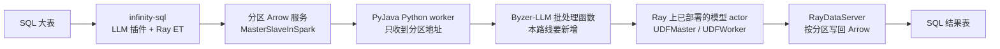

# SQL 大表走 Python/Ray 模型：项目、组件和要改的地方

核对日期：2026-09-24。范围只包括这一条路线：Infinity SQL 里的一张大表，做摘要、分类、embedding 等行级或批量推理，模型进程在 Python/Ray 里，权重留在 Ray worker 上。

不在这条路线里的东西：JVM 直接打 OpenAI 兼容 HTTP（`ai_*` 的 native 分支、`byzer-native-llm`）、短文本交互、token 流式、微调训练本身。它们可以复用下面的传输或 actor，但不是这次要改的调用路径。

三个仓库并列在 `~/projects/`。更早的职责说明见 [项目关系](pyjava-byzer-llm-infinity-sql-relationship.md)，交互取舍见 [高性能交互改进方案](pyjava-byzer-llm-infinity-sql-performance-plan.md)。本文只回答：这条路线上有哪些组件、谁调用谁、谁该改。

## 1. 三个项目各守一段

| 项目 | 在这条路线上的职责 | 不负责 |
| --- | --- | --- |
| `infinity-sql` | SQL 入口、选表、为每个 Spark 分区拉起 Arrow 服务、把分区地址交给 Python、把结果收成表 | 不加载模型，不决定 batch 大小 |
| `pyjava` | JVM 与 Python 之间的 Arrow 传输、Python worker、Ray 上的数据服务和模型 actor 骨架 | 不知道“摘要/分类/embedding”的含义 |
| `byzer-llm` | 部署并常驻模型，按一批文本做生成或 embedding，返回结构化结果 | 不读 Spark 表，不注册 SQL 函数 |

调用方向是固定的：SQL 插件生成或调用 Python，Python 再使用 PyJava 和 Byzer-LLM。Byzer-LLM 不反向依赖 SQL 引擎。PyJava 不依赖 Byzer-LLM。

模型 actor 在批处理之前就已经存在。批处理任务只借 worker、送一批文本、还 worker。它不在每行、也不在每个分区里重新 `deploy`。

## 2. 现在的代码没有走上面这条线

大表如果写成 `select ai_summarize(...)` 或 `select udf(llm_param(...))`，走的是另一条线：

1. `LLM.train` 在 `action="infer"` 时只部署模型并注册一个 Spark 标量函数，返回空表。传入的 DataFrame 被丢掉。`batchPredict` 直接调用同一个 `train`。
2. 之后每一行进入 `Ray.predict` 注册的函数。该函数设置 `directData=true`，借一个 PyJava worker，把这一行 JSON 用 Arrow 送进 Python。
3. 通用分支的预测代码调用 `byzerllm.apps.byzer_sql.chat`。它用 `fetch_once_as_rows()` 把 Arrow 转成 Pandas 行，再按条循环 `chat_oai()`，并且写死 `product_mode="lite"`，也就是 HTTP 客户端，不是刚部署的 Ray actor。
4. `ai_summarize` / `ai_classify` 也是标量函数。有 endpoint 时走 `AIClient`（每次新建 `HttpURLConnection`）。没有 endpoint 时，`AIRouter.rayChat` 仍把一行 JSON 交给上面的 Ray UDF。

所以“模型在 Ray 里”和“SQL 大表在调用它”今天没有接上。部署用 Ray，大表查询要么逐行进 Python worker，要么逐行打 HTTP。

另一条已经存在、但只被微调使用的线，才是大表该复用的数据面：

`custom/SFT.scala` 生成的 Python 调用 `sft_train(ray_context.data_servers(), ...)`。`Ray.distribute_execute` 先为源表每个分区启动 Arrow 服务，再把 `host/port` 交给一个 Python 协调进程。表的内容不经过这个协调进程的 SQL 行，而是由 Python 按地址回拉。

`RayContext.map_batches()` 和 `RayDataServer.serve(func_for_batches=...)` 已经能按 Arrow `RecordBatch` 处理并写回可重读的快照。SQL 的 LLM 插件没有调用它们。

## 3. 目标链路怎么接现有零件

部署保持现有入口，只修协议，不改成逐行推理：

`run command as LLM`，`action="infer"` → `custom.Infer` 或 `m3e.Infer` 等生成 `registerCode` → `Ray.predict` → `ByzerLLM.deploy` → `UDFBuilder.build` → 集群上的 detached `UDFMaster` 和若干 `UDFWorker`。

大表任务新增一条入口，复用微调的数据面，而不是复用 `predictCode`：

1. SQL 指定源表、文本列、任务类型（摘要、分类、embedding）和已经部署的 `udfName`。
2. `Ray.distribute_execute` 导出分区地址。结果用 `dataMode=data`，不要把整表结果收进协调进程。
3. 新的 Byzer-LLM 函数对每个分区调用 `RayContext.map_batches()`。函数里只做切批和调用已有 actor。
4. actor 的 `apply` / `async_apply` 一次接收一批文本。embedding 走已有的 `embed_documents` 这类列表接口；摘要和分类走同一次生成接口，差别只是提示词模板。
5. 结果交回 Spark。未打开 shared 时仍是 `RayDataServer` 加 `readFromStreamWithArrow`。`python.socket.transport=shared` 时，结果是九列快照描述符，引擎用 `readFromSharedSnapshot` 读，确认不再需要后用 `releaseSharedSnapshot` 释放。读一次不会自动释放。

协调进程收到的输入只有分区地址。`RayContext` 在非 `directData` 时会把这些地址行读进来，这个量很小，可以留下。真正的文本必须走 `fetch_arrow_batches()`，不能走 `PythonContext.fetch_once()` 的 Pandas 转换，也不能走 `collect_as_file()` 里再次 `to_pandas()` 的路径。

## 4. 组件清单

状态分三种：**留用**表示这条路线直接调用，接口不用为它改；**要改**表示组件还在，但当前行为堵着这条路线；**新增**表示现在没有对应入口。

### 4.1 infinity-sql

| 组件 | 路径 | 状态 | 要做的事 |
| --- | --- | --- | --- |
| `LLM` | `mlsql-extensions/contrib/byzer-llm/.../LLM.scala` | 要改 | `action="infer"` 继续只负责部署和注册标量函数。为大表增加单独动作（或单独 ET）。这个动作必须把源表交给 `Ray.distribute_execute`，不能再调用 `batchPredict` → `train` 然后丢掉 DataFrame。 |
| `custom.Infer`、`m3e.Infer`、`llama.Infer` 等 | `contrib/byzer-llm/.../{custom,m3e,llama}/Infer.scala` | 留部署，不承担大表 | 它们生成的 `registerCode` 用来 `UDFBuilder.build`。`predictCode` 是标量 UDF 的预测脚本。大表不要再生成或调用这段 `predictCode`。 |
| `custom.SFT` | `contrib/byzer-llm/.../custom/SFT.scala` | 留用其数据面，不改成推理 | 它证明 `data_servers()` 可以把表交给 Python。推理不要塞进 `sft_train`。 |
| `Ray` ET | `streamingpro-mlsql/.../ets/Ray.scala` | 留用，调用方式要明确 | `distribute_execute` 已经做分区服务和单协调进程。大表结果必须设 `dataMode=data`。`predict` 里的标量函数和 `directData=true` 留在短调用上。 |
| `MasterSlaveInSpark.defaultDataServerImpl` | `streamingpro-mlsql/.../tool/MasterSlaveInSpark.scala` | 要改 | 现在调用 `serveToStreamWithArrow` 后一直等到 ServerSocket 关闭，生产 task 被慢速 GPU 占住。这里要能传入 PyJava 已有的 `python.socket.detached=true`，让生产任务先交快照再退出。PyJava 侧开关已经存在，缺的是这个调用点。 |
| `LLMUDF` | `contrib/byzer-llm/.../LLMUDF.scala` | 留用 | `llm_param`、`llm_result`、`llm_stack` 只服务标量调用。大表结果应是普通列，不把每行包成这条 JSON 协议。 |
| `AIUDF`、`AIRouter`、`AIClient` | `mlsql-extensions/core/byzer-ai-core/.../ai/` | 不改这条路线 | `ai_summarize`、`ai_classify` 是逐行 HTTP 或逐行 Ray UDF。大表入口不要接到 `AIRouter.rayChat`。 |
| `byzer-native-llm` | `mlsql-extensions/core/byzer-native-llm/` | 不参与 | 与 `byzer-llm` 插件声明了 `conflictsWith`，不能同时作为有效插件。这条路线只装 `byzer-llm`。 |
| `MLSQLModel` | `contrib/byzer-llm/.../MLSQLModel.scala` | 不参与 | 它把模型目录切成二进制行再分发。模型已经在 Ray 环境里时，不要把权重再送进这条数据面。 |
| 插件注册 | `contrib/byzer-llm/pom.xml`、`LLMApp.scala` | 要改 | 新的大表 ET 或 `action` 要注册进去。构建坐标保持引擎的 Spark 3.3 / Scala 2.12，不要拿 PyJava 默认的 Spark 4.1.2 / Scala 2.13 产物混用。 |

`Ray.distribute_execute` 把数据服务 DataFrame `repartition(1)`，因此一个任务只有一个 Python 协调进程。这是对的：扇出发生在 Ray actor，不发生在 Spark 再启动 N 个 Python worker。协调进程不能自己把全表拉进内存再逐行预测。

### 4.2 pyjava

| 组件 | 路径 | 状态 | 要做的事 |
| --- | --- | --- | --- |
| `UDFMaster` / `UDFWorker` | `python/pyjava/udf/__init__.py` | 要改 | Byzer-LLM 调用 `get.remote(worker_id)` 和 `async_apply.remote(...)`。这里的 `get()` 不接收 worker，空闲时 `sleep` 轮询；worker 只有同步 `apply()`。不先对齐这两个方法，常驻模型就调用不成。返回形态需要能表达一批结果，而不是只适配单行。 |
| `UDFBuilder.build` | 同文件 | 留用 | 部署时创建 detached master。大表任务不要调用 `UDFBuilder.apply`，那个方法会 `fetch_once_as_rows()` 再 `ray.get` 一次。 |
| `PythonWorkerFactory`、`ArrowPythonRunner` | `src/main/java/tech/mlsql/arrow/python/` | 留用 | 只给每个大表任务提供一个协调 worker。不要按行借用 worker。 |
| `SparkSocketRunner`、`ArrowSocketServer` | `.../runner/` | 留用，共享快照是显式开关 | 旧的 `serveToStreamWithArrow` / `readFromStreamWithArrow` 和三列地址不变。大表要改用 `exportToStreamWithArrow`、`readFromSharedSnapshot`、`releaseSharedSnapshot`、`sharedSnapshotStatus`。协议 `pyjava-arrow-snapshot/1`，结果列顺序见 [共享快照](shared-snapshot-transport.md)。`python.socket.detached=true` 仍是另一条一次性文件端点，不是这条。 |
| `PythonContext.fetch_once` | `python/pyjava/api/mlsql.py` | 不用于文本 | 它把 batch 转成 Pandas。协调进程读分区地址可以继续用；文本列不能用。 |
| `RayContext.map_batches` | 同文件 | 留用，共享模式改了结果 actor | 要求 `dataMode=data`。未设置 `python.socket.transport=shared` 时，仍是每个输入分区一个 `RayDataServer`。设置 shared 后，一次 `setup` 只创建有界个常驻 `RaySnapshotWorker`（默认数量等于 `python.ray.inflight.generations`，默认 2），每个 actor 一个监听、多个 token。这是结果 actor 池，不是 TCP 连接池。每个已提交 generation 用 `python.socket.shared.prepare.timeout.ms` 做上限，含调度、transform 和物化，不是整表一次。回调不返回时回收这一批快照 actor 和它的目录，不杀模型 actor，也不 `ray.shutdown`。正常生成结束后 actor 仍在，快照还可读。没有 `map_batches` 的 Byzer 调用方，这条生产队列不会被标量 UDF 路径带上。 |
| `RayContext.connect` | 同文件 | 要改调用约定 | 没有 `UDF_CLIENT` 时会先 `ray.shutdown()` 再 `init`。大表协调进程如果这样连，会拆掉本进程里的 Ray 连接。集群上 `lifetime=detached` 的模型 actor 还在，但每次任务都重连。批处理应走不再 shutdown 的连接方式。 |
| `RayContext.fetch_arrow_batches` | 同文件 | 留用 | `map_batches` 的读取端。超时由 `PYJAVA_SOCKET_TIMEOUT_SECONDS` 控制，慢分区要单独配置，不要靠把生产 task 一直挂着。 |
| `RayDataServer.serve` | `python/pyjava/api/serve.py` | 留用 | `func_for_batches` 已经接到 `serve_replayable`。引擎要在租期内读完；这不是失败后自动重跑模型。 |
| `streaming_tar` | `python/pyjava/storage/` | 不参与 | 模型文件行式打包。权重不走这条路线。 |

JVM 侧版本：引擎声明 `pyjava-version=0.3.3`。Python 侧 Byzer-LLM 要求 `pyjava>=0.6.21`。两边要分开核对。把 JVM 依赖留在 0.3.3，不能说明 Python worker 里导入的 `pyjava.udf` 已经有 `async_apply`。

### 4.3 byzer-llm

| 组件 | 路径 | 状态 | 要做的事 |
| --- | --- | --- | --- |
| `ByzerLLM.deploy` | `src/byzerllm/utils/client/byzerllm_client.py` | 留用 | 继续负责选择后端、加载权重、注册具名 actor。大表任务开始前 actor 必须已经在。 |
| `ByzerLLM._query` | 同文件 | 要改 | 它是单次调用：两次阻塞 `ray.get`（借 worker、执行）再归还。大表要在同一次 `apply` 里送入一批文本，而不是每一行一次 `_query`。`get(worker_id)` 和 `async_apply` 要和 PyJava 对齐。 |
| `apps/byzer_sql.deploy` | `src/byzerllm/apps/byzer_sql/__init__.py` | 留用 | SQL 部署参数到 `ByzerLLM.deploy` 的转换留在这里。 |
| `apps/byzer_sql.chat` | 同文件 | 不用于大表 | `product_mode="lite"`、Pandas、按条 `chat_oai()`。改这个函数会把短调用和批处理缠在一起。大表用新函数。 |
| `apps/byzer_sql.prepare_env` | 同文件 | 要改用法 | 它总是 `RayContext.connect`。大表协调进程可以复用连接逻辑，但不能因此执行 `chat()`。 |
| 新的批处理函数 | 建议放在 `apps/byzer_sql/` | 新增 | 输入是 `RayContext`、任务名、文本列、已部署的 actor 名、批大小。内部只调用 `map_batches`，把一个 Arrow batch 切成模型能吃的微批，再写回带原行标识的 Arrow。摘要、分类、embedding 共用这一层，不各写一套传输。 |
| `simple_predict_func` | `src/byzerllm/utils/text_generator.py` | 不直接当大表实现 | 它已经能识别 `embedding` 标志，但仍然 `for item in data` 逐条 `async_predict`。列表进来也会在 actor 里串行。embedding 应调用 `embed_documents` 这种整批接口；生成类要一次提交多条，而不是套这个循环。 |
| `bge`、`m3e` 等 | `src/byzerllm/bge/__init__.py`，`m3e` 模块 | 留用模型实现 | `embed_documents(texts)` 已经是列表进、列表出。缺的是 SQL 批处理去调用它，不是再加一个逐行 UDF。`m3e.Infer` 只负责部署。 |
| 摘要和分类 | 无独立模块 | 新增的只是任务模板 | 二者不是新的模型类型。它们是同一个生成 actor 上的不同提示词和输出解析。分类的标签集来自 SQL 参数，不要写进 PyJava。 |
| `SimpleByzerLLM`、SaaS 适配器 | `utils/client/simple_byzerllm_client.py` 等 | 不参与 | 那是 HTTP 客户端。本路线的模型在 Ray worker 里。 |

## 5. 谁和谁有关

一次大表任务里，运行中的对象是这些，不要把同名字符串当成同一个对象：

| 对象 | 谁创建 | 谁在大表任务里使用 | 生命周期 |
| --- | --- | --- | --- |
| Spark 分区 Arrow 服务 | `MasterSlaveInSpark` | `RayContext.fetch_arrow_batches` | 一个任务的一分区。detached 打开后，生产 task 可以先结束 |
| Python 协调 worker | `PythonWorkerFactory`，由 `distribute_execute` 借用 | 只跑新的批处理函数 | 任务结束归还。里面没有模型权重 |
| `UDFMaster` / `UDFWorker` | 部署阶段的 `UDFBuilder.build` | 批处理函数按批借用 | detached，跨 SQL 语句保留。卸载要显式做，不能靠 worker 池归还 |
| `RayDataServer` | `RayContext.map_batches` 的旧传输 | 引擎 `dataMode=data` 的旧读回 | 一个输出分区。`serve` 结束会 `exit_actor`。只在未设置 `python.socket.transport=shared` 时使用 |
| `RaySnapshotWorker` | 同一次 `setup`，且 `python.socket.transport=shared` | 引擎用九列描述符读回 | 少量 detached actor，不是连接池。`generate` 在期限内返回后快照仍可读。租约从全部生成完成并 `activate` 起算。每个已提交 generation 的准备期限是 `python.socket.shared.prepare.timeout.ms`（调度 + transform + 物化）。超时、激活失败或协调进程被中断时，只回收这一批 actor 及其独占目录。token 清空后再空闲 `python.ray.snapshot.actor.idle.ms`（默认 60 秒）退出。不会 `ray.shutdown`，也不会结束模型 actor |
| Spark 标量 UDF | `Ray.predict` | 短调用，大表不用 | 跟 Spark session |

关联上的断点就两处：

- **引擎 → Byzer-LLM**：今天 `Infer` 只把部署代码和标量 `predictCode` 交给 `Ray`。大表需要第三段代码，调用新的批处理函数，并设置 `dataMode=data` 和源表。
- **Byzer-LLM → PyJava actor**：`_query` 使用的 `get(worker_id)`、`async_apply` 在当前 PyJava 里不存在。批处理函数即使写出来，也会在借 worker 时失败。

PyJava 的 Arrow 读回和 `map_batches` 没有等待这个协议修复才能存在，但整条路线要等协议对齐后才能测吞吐。

## 6. 改动顺序

1. **PyJava 与 Byzer-LLM 对齐 actor 协议**，并确认协调进程导入的就是这份 PyJava。同时把 PyJava 的 JVM 包按引擎的 Spark 3.3 / Scala 2.12 构建。这是同一条路线的两个二进制，不能互相代替。
2. **在 Byzer-LLM 增加批处理函数**，只通过 `map_batches` 调用已经部署的 actor。embedding 走列表接口；摘要和分类走同一生成入口的不同模板。
3. **在 SQL 插件增加大表动作**，复用 `distribute_execute` 和 `dataMode=data`。不要改 `ai_*`，也不要改 `chat()`。
4. **让 `MasterSlaveInSpark` 能打开 detached 快照**，避免慢推理占着生产 task。快照有配额和租约，不能写成失败后自动重算。

第 2 步和第 3 步可以同时写，但第 1 步没完成时，后两步无法在集群上验证。标量 UDF 和 `AIClient` 保持原样，避免短调用和大表共用一个越改越大的函数。

## 7. 源码位置

| 角色 | 文件 |
| --- | --- |
| 大表分区导出与 `dataMode` | `infinity-sql/streamingpro-mlsql/src/main/java/tech/mlsql/ets/Ray.scala` |
| 生产 task 生命周期 | `infinity-sql/streamingpro-mlsql/src/main/java/tech/mlsql/tool/MasterSlaveInSpark.scala` |
| SQL 动作分派 | `infinity-sql/mlsql-extensions/contrib/byzer-llm/src/main/java/tech/mlsql/plugins/llm/LLM.scala` |
| 通用部署与标量预测脚本 | `.../custom/Infer.scala` |
| embedding 部署脚本 | `.../m3e/Infer.scala` |
| 微调使用的数据面 | `.../custom/SFT.scala` |
| 标量 `ai_*` 与 Ray 回退 | `infinity-sql/mlsql-extensions/core/byzer-ai-core/src/main/java/tech/mlsql/plugins/llm/ai/AIModelRuntime.scala` |
| actor 骨架 | `pyjava/python/pyjava/udf/__init__.py` |
| 分区消费与 `map_batches` | `pyjava/python/pyjava/api/mlsql.py` |
| 结果服务 | `pyjava/python/pyjava/api/serve.py` |
| 部署与单次 `_query` | `byzer-llm/src/byzerllm/utils/client/byzerllm_client.py` |
| SQL 侧 `deploy` / `chat` | `byzer-llm/src/byzerllm/apps/byzer_sql/__init__.py` |
| 逐条预测与 embedding 标志 | `byzer-llm/src/byzerllm/utils/text_generator.py` |

本次只对照源码，没有部署模型，也没有对大表跑摘要、分类或 embedding。
